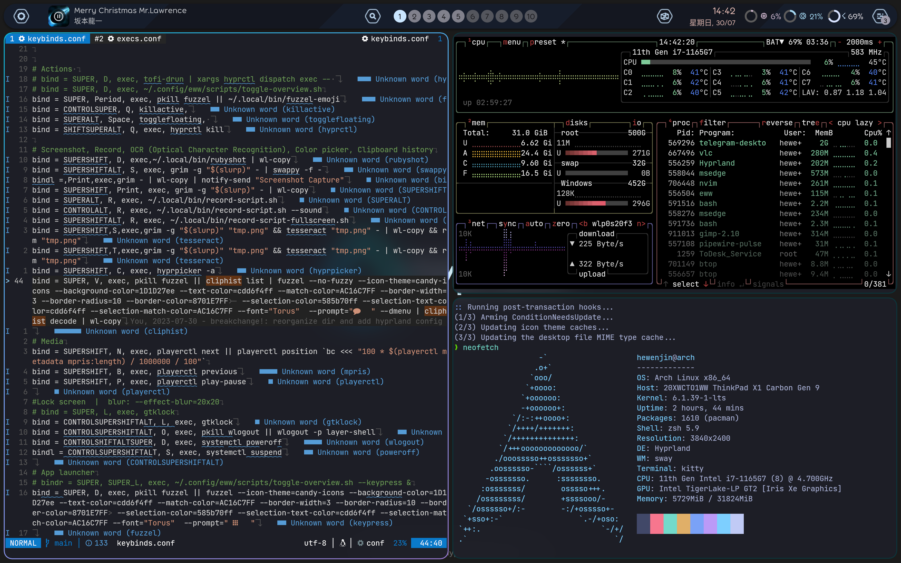

# Personal config

Use to management my personal configuration, If something here is helpful, You can also use any code you like from this repo.

This repo's structure just as same as your $HOME.

Some config in neovim and tmux needs to set patch font in your terminal emulator, recommand one of the [nerd font](https://github.com/ryanoasis/nerd-fonts)

NOTE: I'm a Arch Linux user, so I upgrade my system almost everyday. If something here not working well for you, you should try the nightly version, or just join Arch Linux :).

Also I had optimize this repo size recently by using [git-filter-repo](https://github.com/newren/git-filter-repo/), so is ok that if you see commits in here have much less then before, that's ok, nothing is lost, just changed direction.

## Some directory that I really speed lot time

### .config/nvim
My neovim configuration. since neovim 0.5 version, lot plugins are not compatible with vim, so I completely separated vim and neovim configuration. 

### .config/hypr
[hypr](https://github.com/hyprwm/Hyprland) a wayland based compositor

### Note that some directory have `readme.md`, That's some special operations and memos I recorded, the `/project/my/config` path in each readme file must be replace with your own path

some CLI tools I'm currently using:

[tmux](https://github.com/tmux/tmux) just at gnome

[ranger](https://github.com/ranger/ranger)

[ripgrep](https://github.com/BurntSushi/ripgrep)

[fd](https://github.com/sharkdp/fd)

[fzf](https://github.com/junegunn/fzf)

[bat](https://github.com/sharkdp/bat)

[lsd](https://github.com/Peltoche/lsd)

[thefuck](https://github.com/nvbn/thefuck) just for fun :)

