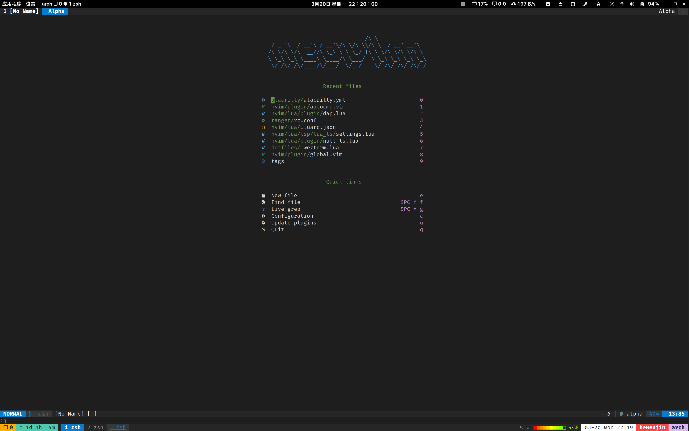

# Personal config

Use to management my personal configuration, If something here is helpful, You can also use any code you like from this repo.

Some config in neovim and tmux needs to set patch font in your terminal emulator, recommand one of the [nerd font](https://github.com/ryanoasis/nerd-fonts)

NOTE: I'm a Arch Linux user, so I upgrade my system almost everyday. If something here not working well for you, you should try the nightly version, or just join Arch Linux :).

## directory description
### dotfiles
My home directory dotfiles. note that `.vimrc` is deprecated, I use neovim now.
To use `dotfiles/.tmux.conf.local`, [tmux](https://github.com/tmux/tmux) & [oh-my-tmux](https://github.com/gpakosz/.tmux) needs to install first. 

### .config/nvim
My neovim configuration. since neovim 0.5 version, lot plugins are not compatible with vim, so I completely separated vim and neovim configuration. 

### IM
Input method config

### DE
Desktop environment config backup

### .config/alacritty
[alacritty](https://github.com/alacritty/alacritty) config

### .config/ranger
The [ranger](https://github.com/ranger/ranger) TUI file manager config

### .config/ctags
[ctag](https://ctags.io/) config

### Note that some directory have `readme.md`, That's some special operations and memos I recorded, the `/project/my/config` path in each readme file must be replace with your own path
