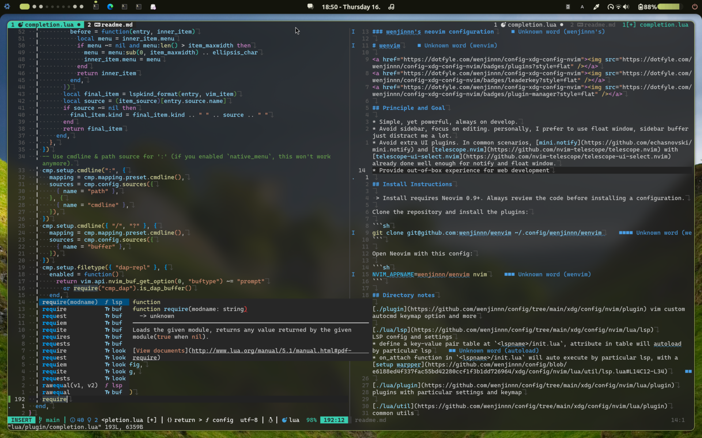

### wenjinnn's neovim configuration

# wenvim

<a href="https://dotfyle.com/wenjinnn/config-xdg-config-nvim"></a>
<a href="https://dotfyle.com/wenjinnn/config-xdg-config-nvim"></a>
<a href="https://dotfyle.com/wenjinnn/config-xdg-config-nvim"></a>



## Principle and Goal

* Simple, yet powerful, always on develop.
* Lazy load all plugins if it could, to optimize startup time to the shortest possible time, right now on my PC, the startup time are less then 30ms.
* Avoid sidebar, focus on editing. personally, I prefer to use float window, sidebar buffer just distract me a lot.
* Avoid extra UI plugins. In common scenarios, [mini.notify](https://github.com/echasnovski/mini.notify) and [mini.pick](https://github.com/echasnovski/mini.pick) with `vim.ui.select()` wrapper already done well enough for notify and float window.
* Provide out-of-box experience for web development

## Install Instructions

 > Install requires Neovim 0.10+. Always review the code before installing a configuration.

Clone the repository and install the plugins:

```sh
git clone git@github.com:wenjinnn/wenvim ~/.config/wenjinnn/wenvim
```

Open Neovim with this config:

```sh
NVIM_APPNAME=wenjinnn/wenvim nvim
```

## Directory notes

[./plugin](https://github.com/wenjinnn/config/tree/main/xdg/config/nvim/plugin) vim custom autocmd keymap option and more

[./lua/lsp](https://github.com/wenjinnn/config/tree/main/xdg/config/nvim/lua/lsp)
LSP config and settings
* define a key-value pair table at `<lspname>/init.lua`, attribute in table will autoload by particular lsp
* on_attach function in `<lspname>/init.lua` will auto execute by particular lsp, with a [setup warpper](https://github.com/wenjinnn/config/blob/e6188ed4f337fac55bd42280ccf1f3b1dd726964/xdg/config/nvim/lua/util/lsp.lua#L14C12-L34)

[./lua/plugin](https://github.com/wenjinnn/config/tree/main/xdg/config/nvim/lua/plugin)
plugins with particular settings and keymap

[./lua/util](https://github.com/wenjinnn/config/tree/main/xdg/config/nvim/lua/plugin)
common utils

[./after](https://github.com/wenjinnn/config/tree/main/xdg/config/nvim/after)
just some filetype settings

## Defined environment variables cheatsheets:

### Common

`LAZY_NVIM_LOCK_PATH` lazy.nvim lockfile path, if not set, fallback to lazy.nvim default setting

`TELESCOPE_FILE_IGNORE_PATTERNS` telescope.nvim file ignore patterns, if not set, the pattern is { "^.git/", "^node_modules/" }

### Dap

`PROJECT_NAME` nvim-dap config for dap configuration `projectName`

`DAP_HOST` nvim-dap config for setting host, most used at remote debug situations.

`DAP_HOST_PORT` like above, but for host port

### Java

`JAVA_HOME` fallback java home

`JAVA_8_HOME` java 8 home

`JAVA_17_HOME` java 17 home

`JAVA_21_HOME` java 21 home

`JDTLS_MAVEN_SETTINGS`  jdtls maven user settings.xml path

`JDTLS_JAVA_HOME` jdtls java home, if not set, fallback to `JAVA_21_HOME`

### Must have
1. [ripgrep](https://github.com/BurntSushi/ripgrep) and [fd](https://github.com/sharkdp/fd) for many plugin.

### Recommend
1. [tmux](https://github.com/tmux/tmux) & [oh-my-tmux](https://github.com/gpakosz/.tmux) for terminal multiplexing, I'm using only at wsl.
2. [lazygit](https://github.com/jesseduffield/lazygit) smooth git operation.

## Main Plugins

### code-runner

+ [michaelb/sniprun](https://dotfyle.com/plugins/michaelb/sniprun)
### color

+ [echasnovski/mini.hipatterns](https://dotfyle.com/plugins/echasnovski/mini.hipatterns)
### colorscheme

+ [catppuccin/nvim](https://dotfyle.com/plugins/catppuccin/nvim)
### comment

+ [JoosepAlviste/nvim-ts-context-commentstring](https://dotfyle.com/plugins/JoosepAlviste/nvim-ts-context-commentstring)
### completion

+ [hrsh7th/nvim-cmp](https://dotfyle.com/plugins/hrsh7th/nvim-cmp)
### debugging

+ [mfussenegger/nvim-dap](https://dotfyle.com/plugins/mfussenegger/nvim-dap)
+ [theHamsta/nvim-dap-virtual-text](https://dotfyle.com/plugins/theHamsta/nvim-dap-virtual-text)
### editing-support

+ [echasnovski/mini.pairs](https://dotfyle.com/plugins/echasnovski/mini.pairs)
+ [echasnovski/mini.splitjoin](https://dotfyle.com/plugins/echasnovski/mini.splitjoin)
+ [nvim-treesitter/nvim-treesitter-context](https://dotfyle.com/plugins/nvim-treesitter/nvim-treesitter-context)
+ [echasnovski/mini.basics](https://dotfyle.com/plugins/echasnovski/mini.basics)
+ [windwp/nvim-ts-autotag](https://dotfyle.com/plugins/windwp/nvim-ts-autotag)
+ [echasnovski/mini.ai](https://dotfyle.com/plugins/echasnovski/mini.ai)
### file-explorer

+ [echasnovski/mini.files](https://dotfyle.com/plugins/echasnovski/mini.files)
### formatting

+ [echasnovski/mini.align](https://dotfyle.com/plugins/echasnovski/mini.align)
+ [stevearc/conform.nvim](https://dotfyle.com/plugins/stevearc/conform.nvim)
### fuzzy-finder

+ [echasnovski/mini.pick](https://dotfyle.com/plugins/echasnovski/mini.pick)
### git

+ [echasnovski/mini.diff](https://dotfyle.com/plugins/echasnovski/mini.diff)
+ [echasnovski/mini-git](https://dotfyle.com/plugins/echasnovski/mini-git)
### indent

+ [echasnovski/mini.indentscope](https://dotfyle.com/plugins/echasnovski/mini.indentscope)
### keybinding

+ [echasnovski/mini.clue](https://dotfyle.com/plugins/echasnovski/mini.clue)
### lsp

+ [neovim/nvim-lspconfig](https://dotfyle.com/plugins/neovim/nvim-lspconfig)
+ [mfussenegger/nvim-jdtls](https://dotfyle.com/plugins/mfussenegger/nvim-jdtls)
+ [mfussenegger/nvim-lint](https://dotfyle.com/plugins/mfussenegger/nvim-lint)
+ [b0o/SchemaStore.nvim](https://dotfyle.com/plugins/b0o/SchemaStore.nvim)
### lsp-installer

+ [williamboman/mason.nvim](https://dotfyle.com/plugins/williamboman/mason.nvim)
### markdown-and-latex

+ [iamcco/markdown-preview.nvim](https://dotfyle.com/plugins/iamcco/markdown-preview.nvim)
### marks

+ [chentoast/marks.nvim](https://dotfyle.com/plugins/chentoast/marks.nvim)
### motion

+ [folke/flash.nvim](https://dotfyle.com/plugins/folke/flash.nvim)
+ [echasnovski/mini.bracketed](https://dotfyle.com/plugins/echasnovski/mini.bracketed)
### note-taking

+ [chipsenkbeil/org-roam.nvim](https://dotfyle.com/plugins/chipsenkbeil/org-roam.nvim)
+ [nvim-orgmode/orgmode](https://dotfyle.com/plugins/nvim-orgmode/orgmode)
### nvim-dev

+ [nvim-lua/plenary.nvim](https://dotfyle.com/plugins/nvim-lua/plenary.nvim)
+ [MunifTanjim/nui.nvim](https://dotfyle.com/plugins/MunifTanjim/nui.nvim)
### plugin-manager

+ [folke/lazy.nvim](https://dotfyle.com/plugins/folke/lazy.nvim)
### preconfigured

+ [LazyVim/LazyVim](https://dotfyle.com/plugins/LazyVim/LazyVim)
### search

+ [windwp/nvim-spectre](https://dotfyle.com/plugins/windwp/nvim-spectre)
### session

+ [echasnovski/mini.sessions](https://dotfyle.com/plugins/echasnovski/mini.sessions)
### snippet

+ [rafamadriz/friendly-snippets](https://dotfyle.com/plugins/rafamadriz/friendly-snippets)
### split-and-window

+ [echasnovski/mini.bufremove](https://dotfyle.com/plugins/echasnovski/mini.bufremove)
### startup

+ [echasnovski/mini.starter](https://dotfyle.com/plugins/echasnovski/mini.starter)
### statusline

+ [nvim-lualine/lualine.nvim](https://dotfyle.com/plugins/nvim-lualine/lualine.nvim)
### syntax

+ [nvim-treesitter/nvim-treesitter-textobjects](https://dotfyle.com/plugins/nvim-treesitter/nvim-treesitter-textobjects)
+ [echasnovski/mini.surround](https://dotfyle.com/plugins/echasnovski/mini.surround)
+ [nvim-treesitter/nvim-treesitter](https://dotfyle.com/plugins/nvim-treesitter/nvim-treesitter)
### terminal-integration

+ [akinsho/toggleterm.nvim](https://dotfyle.com/plugins/akinsho/toggleterm.nvim)
### utility

+ [echasnovski/mini.notify](https://dotfyle.com/plugins/echasnovski/mini.notify)
+ [jellydn/hurl.nvim](https://dotfyle.com/plugins/jellydn/hurl.nvim)

 Part of this readme was generated by [Dotfyle](https://dotfyle.com)

